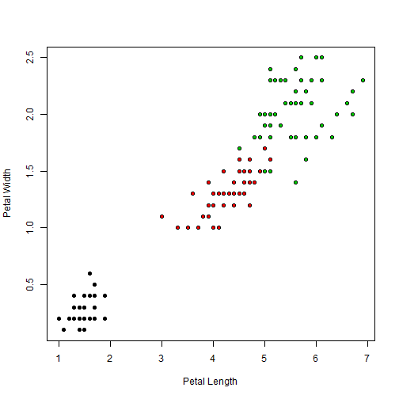
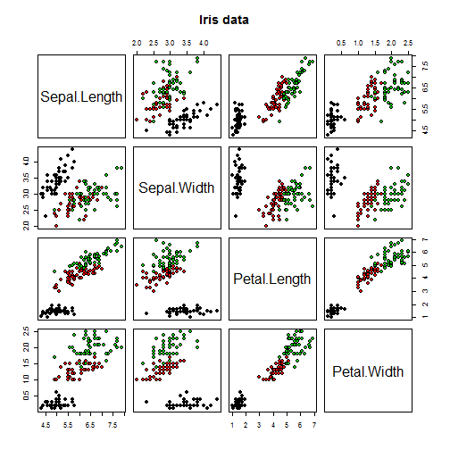

## IRIS Data

```r
data(iris)
str(iris)
```

```
## 'data.frame':	150 obs. of  5 variables:
##  $ Sepal.Length: num  5.1 4.9 4.7 4.6 5 5.4 4.6 5 4.4 4.9 ...
##  $ Sepal.Width : num  3.5 3 3.2 3.1 3.6 3.9 3.4 3.4 2.9 3.1 ...
##  $ Petal.Length: num  1.4 1.4 1.3 1.5 1.4 1.7 1.4 1.5 1.4 1.5 ...
##  $ Petal.Width : num  0.2 0.2 0.2 0.2 0.2 0.4 0.3 0.2 0.2 0.1 ...
##  $ Species     : Factor w/ 3 levels "setosa","versicolor",..: 1 1 1 1 1 1 1 1 1 1 ...
```
How many species of Iris are in the data?


```r
unique(iris$Species)
```

```
## [1] setosa     versicolor virginica 
## Levels: setosa versicolor virginica
```

--- .class #1

## Plotting Petal Length against Petal Width

```r
plot(iris$Petal.Length, iris$Petal.Width, pch=21, xlab="Petal Length", ylab="Petal Width", bg = c("black", "red", "green3")[unclass(iris$Species)])
```

 

--- .class #2 

## Plotting Sepal info. against Petal info.

```r
pairs(iris[1:4], main="Iris data", pch=21, bg = c("black", "red", "green3")[unclass(iris$Species)])
```

 

--- &radio

## Quiz on Iris
Which species has the shortest average petal length?

1. _Setosa_
2. Versicolor
3. Virginica

*** .hint 
It starts with an es.

*** .explanation 
Setosa has an average petal length of 1.46.
